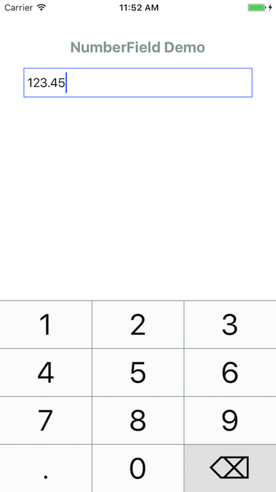

# NumberField

[](http://cocoapods.org/pods/NumberField)
[](http://cocoapods.org/pods/NumberField)
[](http://cocoapods.org/pods/NumberField)
[](http://cocoapods.org/pods/NumberField)



## Requirements

iOS 9.0 or above

## Installation

#### CocoaPods

NumberField is available through [CocoaPods](http://cocoapods.org). To install
it, simply add the following line to your Podfile:

```ruby
pod "NumberField"
```

## Usage

**Programmatically**<br>

```swift
// Create NumberField instance
let numberField = NumberField()
numberField.textAlignment = .right
numberField.maxValue = 9999.99
numberField.decimalPlace = 2
addSubview(numberField)

// Set value
numberField.value = 123.45

// Get value
let sellingPrice = numberField.value
```

**Storyboard**<br>

1. Drag an UIView into Storyboard.
2. Set class to "NumberField".


## NumberField Customization

| Parameter          | Type                 | Description                              | Default  |
| ------------------ | -------------------- | ---------------------------------------- | -------- |
| *maxValue*         | Double               | Maximum value.                           | *true*   |
| *decimalPlace*     | Int                  | Number of decimal place. 0 means integer. | *0*      |
| *textAlignment*    | NumberFieldAlignment | Text alignment. (.left / .right)         | *.right* |
| *font*             | UIFont               | Text font.                               | *-*      |
| *textColor*        | UIColor              | Text color.                              | *5.0*    |
| *highlightedColor* | UIColor              | Highlighted color                        | *-*      |


## Keyboard Customization

| Parameter                   | Type    | Description                              | Default |
| --------------------------- | ------- | ---------------------------------------- | ------- |
| *keyboardHeight*            | CGFloat | Keyboard Height.                         | *260*   |
| *keyboardBorderColor*       | UIColor | Border line color between keyboard buttons. | *-*     |
| *keyboardTextColor*         | UIColor | Text color of keyboard buttons.          | *-*     |
| *keyboardBackgroundColor*   | UIColor | Background color of keyboard buttons.    | *-*     |
| *keyboardDecimalPlaceColor* | UIColor | Background color of decimal place button. | *-*     |
| *keyboardBackspaceColor*    | UIColor | Background color of backspace button.    | *-*     |

## 

## Events

Listen to 4 events: `editingDidBegin`, `editingDidEnd`, `editingChanged` or `editingRejected`.

```swift
//Listen to editing begin:
numberField.addTarget(self, action: #selector(numberFieldEditingDidBegin), for: .editingDidBegin)

//Listen editing end:
numberField.addTarget(self, action: #selector(numberFieldEditingDidEnd), for: .editingDidEnd)

//Listen to value changed on edit.
numberField.addTarget(self, action: #selector(numberFieldEditingChanged), for: .editingChanged)

//Listen to value rejected on edit. i.e. Value exceeded maximum value.
numberField.addTarget(self, action: #selector(numberFieldEditingRejected), for: .editingRejected)

//Your functions:
func numberFieldEditingDidBegin(numberField: NumberField) { ... }
func numberFieldEditingDidEnd(numberField: NumberField) { ... }
func numberFieldEditingChanged(numberField: NumberField) { ... }
func numberFieldEditingRejected(numberField: NumberField) { ... }
```


## Author

Kenneth Tsang, kenneth.tsang@me.com

## License

NumberField is available under the MIT license. See the LICENSE file for more info.
